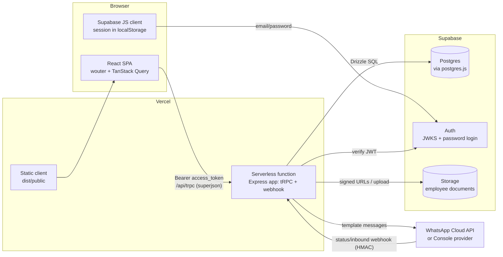

# Skillio — Complete Project Guide

**How every component and feature works**

> Skillio is a full-stack "outcome intelligence" dashboard for a government skilling mission
> (Government of Maharashtra · Skills, Employment & Entrepreneurship). It tracks what happens to
> trainees *after* training — verified employment, 90-day retention, wage progression — and turns
> that data into follow-ups, employer verification, an employee portal, verifiable career
> passports, a job exchange, benefits, and a grievance desk.
>
> Repo: https://github.com/SujayYadav776/Skillio · Live: https://skillio-delta.vercel.app
> Demo staff login: `admin@skillio.test` (password documented in `ROADMAP.md`; demo-only).

---

## Table of contents

1. [Tech stack at a glance](#1-tech-stack-at-a-glance)
2. [Architecture overview](#2-architecture-overview)
3. [Request lifecycle (login → dashboard, end to end)](#3-request-lifecycle-login--dashboard-end-to-end)
4. [Repository layout](#4-repository-layout)
5. [Data model](#5-data-model)
6. [Authentication & access control](#6-authentication--access-control)
7. [Capability tokens (links as authorization)](#7-capability-tokens-links-as-authorization)
8. [Backend API reference](#8-backend-api-reference)
9. [How every feature works](#9-how-every-feature-works)
10. [Messaging subsystem](#10-messaging-subsystem)
11. [The scheduler](#11-the-scheduler)
12. [Frontend architecture](#12-frontend-architecture)
13. [Page-by-page guide](#13-page-by-page-guide)
14. [Design system](#14-design-system)
15. [Build pipeline & runtime modes](#15-build-pipeline--runtime-modes)
16. [Vercel deployment (and the ESM bug it required fixing)](#16-vercel-deployment-and-the-esm-bug-it-required-fixing)
17. [Database migrations & seed data](#17-database-migrations--seed-data)
18. [Testing strategy](#18-testing-strategy)
19. [Environment variables](#19-environment-variables)
20. [Security & privacy design](#20-security--privacy-design)
21. [Known gaps & future work](#21-known-gaps--future-work)

---

## 1. Tech stack at a glance

| Layer | Choice | Where |
|---|---|---|
| Frontend | React 19 + TypeScript, Vite 7 | `client/src` |
| Routing | wouter (lazy routes via `React.lazy`) | `client/src/App.tsx` |
| Styling | Tailwind CSS 4 (CSS-first `@theme`) + hand-rolled shadcn-style Radix primitives | `client/src/index.css`, `client/src/components/ui` |
| Charts | Recharts (split into its own chunk) | dashboard, portal |
| Data layer | tRPC 11 + TanStack Query + superjson | `client/src/lib/trpc.ts`, `server/routers.ts` |
| Server | Express 4 | `server/_core/app.ts` |
| ORM / DB | Drizzle ORM → Supabase Postgres (PgBouncer, `prepare:false`) | `drizzle/schema.ts`, `server/db.ts` |
| Auth | Supabase Auth (email + password), JWT verified server-side via JWKS | `client/src/lib/supabase.ts`, `server/_core/supabaseAuth.ts` |
| File storage | Supabase Storage (employee documents) | `server/_core/supabaseStorage.ts` |
| Messaging | Provider-neutral adapter: Console (default) or WhatsApp Cloud API + signed webhook | `server/messaging` |
| Tests | Vitest (unit + live-DB integration), sequential files | `server/**/*.test.ts` |
| Deployment | GitHub (source) → Vercel (static SPA + one serverless function) | `vercel.json`, `api/index.ts` |

Package manager is **pnpm 10.4.1** (`packageManager` field; run via `corepack pnpm …`).

---

## 2. Architecture overview



Key idea: **one Express app, three runtimes.** The same `createBaseApp()`
(`server/_core/app.ts`) runs under (a) `tsx watch` + Vite middleware in dev,
(b) a long-lived Node process serving static files in local production, and
(c) a Vercel serverless function handling only `/api/*`.

```
client ──► tRPC client ──► /api/trpc ──► appRouter ──► createContext (JWT→user)
                                                     ──► guards (staff / public / rate-limited)
                                                     ──► queries.ts / benefits.ts / passport.ts / …
                                                     ──► Drizzle ──► Supabase Postgres
```

---

## 3. Request lifecycle (login → dashboard, end to end)

1. **Sign in.** `Login.tsx` calls `signIn()` → `supabase.auth.signInWithPassword`. The session
   (access/refresh JWTs) is persisted by supabase-js in `localStorage`.
2. **Token attached to every API call.** The tRPC `httpBatchLink` in `main.tsx` has an async
   `headers()` that reads `getAccessToken()` and sends `Authorization: Bearer <jwt>`.
3. **Server resolves the user.** `createContext` (`server/_core/context.ts`) calls
   `getSupabaseUser(req)` (`server/_core/supabaseAuth.ts`): extracts the Bearer token (or
   `sb-access-token` cookie), verifies it with `jose.jwtVerify` against Supabase's **JWKS**
   (`{SUPABASE_URL}/auth/v1/.well-known/jwks.json`, issuer `{SUPABASE_URL}/auth/v1`), then
   **mirrors** the identity into the local `users` table (`upsertUser` on first login; refreshes
   `lastSignedIn` afterwards). Any failure ⇒ `user = null` (public procedures still work).
4. **Guard.** `staffProcedure` (= `protectedProcedure`) throws `UNAUTHORIZED` with message
   `"Please login (10001)"` when `ctx.user` is null.
5. **401 on the client.** A cache subscription in `main.tsx` intercepts any tRPC error with that
   exact message and calls `goToLogin()` → `/login?next=<current path>` (full page navigation).
6. **Data.** The procedure runs SQL through Drizzle (`runDb()` wrapper maps DB errors to tRPC
   codes), shapes rows via `mappers.ts` into the UI types from `shared/demoData.ts`, and returns
   them through the **superjson** transformer (Dates survive intact).
7. **Render.** TanStack Query caches the result; CommandCentre renders KPI cards + charts.

---

## 4. Repository layout

```
Skillio/
├── client/                 # React SPA (Vite root = client/)
│   ├── index.html
│   └── src/
│       ├── main.tsx        # providers, tRPC client, 401 redirect
│       ├── App.tsx         # lazy routes + shell decision
│       ├── lib/            # supabase.ts, trpc.ts, utils
│       ├── contexts/       # ThemeContext
│       ├── hooks/          # useAuth, usePersistFn, useComposition
│       ├── components/     # SkillioShell (nav), ui/* (6 primitives), ErrorBoundary
│       └── pages/          # 14 screens (see §13)
├── server/
│   ├── _core/              # app.ts, index.ts, vercel-entry.ts, trpc.ts, context.ts,
│   │                       # supabaseAuth.ts, supabaseStorage.ts, cipher.ts, rateLimit.ts,
│   │                       # cookies.ts, env.ts, systemRouter.ts, vite.ts
│   ├── messaging/          # types.ts, index.ts, consoleProvider.ts, whatsapp.ts, webhook.ts
│   ├── routers.ts          # the whole tRPC API
│   ├── queries.ts          # domain queries/mutations (~2k lines: register, outcome chain,
│   │                       #   tokens, pulse, verification, scorecards, timeline)
│   ├── benefits.ts · exchange.ts · passport.ts · grievances.ts · mappers.ts
│   ├── scheduler.ts · seed.ts · applyRls.ts · db.ts
│   └── *.test.ts           # unit + integration suites
├── shared/                 # const.ts, types.ts, demoData.ts (UI types + static demo mirror)
├── drizzle/                # schema.ts, relations.ts (empty), migrations/ (0000–0007)
├── api/index.ts            # Vercel function (thin re-export of dist/serverless.mjs)
├── scripts/build-serverless.mjs
├── patches/wouter@3.7.1.patch
├── vercel.json · vite.config.ts · vitest.config.ts · drizzle.config.ts · tsconfig.json
└── ROADMAP.md · TECH_STACK.md · RECOMMENDATION.md
```

---

## 5. Data model

All tables live in `drizzle/schema.ts` (Postgres, `serial` ids, `pgEnum` for statuses).
`drizzle/relations.ts` is intentionally empty — joins are written by hand in `queries.ts`.

### Core register

| Table | Purpose | Notable columns |
|---|---|---|
| `trainees` | The outcome register (one row per person, denormalized "current state") | unique `traineeRef` (SKL-xxxx) + `slug`; district/provider/course/cohort; `outcomeType/Label/Status`, `wageBand`, `relevance`, `retentionDays`, `barrier`, `contactPhone` (messaging-only, never rendered), `consentStatus`, `lastUpdated` |
| `trainingRecords` | System of record for the course itself | enrolment/completion dates, `attendanceRate`, `assessmentScore`, `certificationStatus`, `sourceSystem` |
| `outcomeEvents` | **Append-only outcome chain** (history is never edited) | `state` ∈ reported/active/ended/disputed/superseded, `supersedesEventId`, `evidenceConfidence` (0–1), `source` (`trainee_mobile`, `employer_verification`, `provider_import`), wage band, start/end dates |
| `consentGrants` | Purpose-scoped consent ledger | `purposeCode`, state granted/withdrawn/expired/superseded, `noticeVersion`, `languageCode`, `receiptHash` (SHA-256) |
| `users` | Staff mirror of Supabase auth | `openId` unique (= Supabase user uuid), `role` user/admin, nullable `district` (**null = sees all districts**) |

### Operations

| Table | Purpose |
|---|---|
| `followUpTasks` | Checkpoint queue: purpose, `checkpointCode`, `dueAt`, `preferredChannel`, `attemptNumber`, status scheduled→queued→sent→completed/declined/failed/expired/cancelled, assigned counsellor |
| `messageJobs` | Outbound ledger with **unique `idempotencyKey`**, provider message id, attempt count, error codes |
| `counsellorCases` | Escalations & grievances: `kind` (escalation/grievance/wage_dispute/harassment/benefit/other), priority P1–P4, status open/assigned/resolved/snoozed, due date |
| `caseMessages` | Support-thread messages (author staff/employee/system). Inbound WhatsApp *content* is never persisted |
| `auditEvents` | Append-only audit: actor type, action, entity, purpose, `requestId`, JSON metadata |
| `oneTimeTokens` | Persisted JWT `jti`s so links can be single-use or revocable across processes |

### Employee system

| Table | Purpose |
|---|---|
| `employees` | Portal membership, **unique 1:1 with trainee**; auto-created when employer-verified employment lands (`ensureEmployee`) |
| `employeeDocuments` | Private vault metadata: kind, `storagePath` in Supabase Storage, mime, size, consent purpose, `retentionUntil` (certificates kept indefinitely, others 24 months) |
| `passports` / `passportEntries` / `passportShares` | Verified Career Passport: unguessable `publicId` (nanoid-16), status draft/published/revoked, opt-in `shareWageBands`/`shareEmployerNames`, `contentHash`; snapshot claims with `evidenceLevel`; revocable share links (scope summary/full, view counts) |
| `employers` / `jobPostings` / `jobApplications` | Job exchange: employer registry, open postings (course tags JSONB, seats, wage band), referral pipeline with deterministic `matchScore` + explainable `matchFactors` |
| `benefitSchemes` / `employeeBenefits` | Centrally-authored schemes with JSONB `eligibilityRules`; materialised claims with unique `(employeeId, schemeId)`, status eligible→applied→approved→received |

### The outcome chain (the heart of the model)

`createOutcomeEvent()` in `queries.ts` is the **only** way outcomes change:

1. Find the trainee's single `state="active"` event.
2. Insert the new event as `active` with `supersedesEventId = old.id`.
3. Flip the old event to `superseded` and stamp its `effectiveEndDate`.
4. Update the denormalized `trainees` row (outcome type/label/status, wage band, `lastUpdated`).
5. If `source === "employer_verification"` and the outcome is employment → `ensureEmployee()`
   opens the employee portal (this is how "placement" becomes a person with a career page).

Nothing is ever deleted — dashboards read the current row, timelines and wage progression read the
chain. The scheduler's `enforceSingleActiveOutcome()` repairs invariant violations (duplicate
active events) as a safety net.

---

## 6. Authentication & access control

### Three independent axes

1. **Staff identity** — Supabase email/password → JWT → JWKS verification → mirrored `users` row.
2. **Role & district scope** — `districtScope(user)` in `routers.ts`:
   - `role="admin"` **or** staff with `district = null` → sees everything;
   - district-assigned counsellor → sees only their district.
   Applied **both** in SQL (`listTrainees`, postings, applications, placement board, open cases)
   **and** as post-filters (summary districts array, cohorts, watchlist, queue). A scoped user
   cannot widen the filter: `effective = scope ?? requestedDistrict`. Cross-district reads of a
   single trainee throw `NotFoundError` (indistinguishable from "doesn't exist" — no probing).
3. **Capability tokens** — public endpoints whose *input token* is the authorization (§7).

### tRPC middleware stack (`server/_core/trpc.ts`)

| Middleware | Behavior |
|---|---|
| `publicProcedure` | No auth required |
| `protectedProcedure` / `staffProcedure` | Requires `ctx.user`, else `UNAUTHORIZED` "Please login (10001)" |
| `adminProcedure` | Requires role admin (defined; routers currently use `staffProcedure`) |
| `rateLimited(opts)` | Wraps public procedures; throws `TOO_MANY_REQUESTS` with retry-seconds |

`runDb()` (routers.ts) is the single error-mapping wrapper: DB not configured →
`PRECONDITION_FAILED`; `NotFoundError` → `NOT_FOUND` (same code for bad links and missing rows,
deliberately); validation → `BAD_REQUEST`; everything else → generic 500 via the Express error
handler (never leaks internals).

### Rate limiting (`server/_core/rateLimit.ts`)

In-memory fixed-window buckets keyed by client IP (`x-forwarded-for` first hop). Applied to every
token-gated public surface: pulse response 20/min, employer verification 20/min, `employee.me`
30/min, benefits 20–30/min, grievance ops 10–30/min. (Single-instance only — noted as a
scaling concern in §21.)

### Row-Level Security (`server/applyRls.ts`, `pnpm db:rls`)

Enables `ROW LEVEL SECURITY` on all 21 tables **with no policies** → deny-by-default for the
`anon`/`authenticated` PostgREST roles. The app connects via the service-role `DATABASE_URL`,
which bypasses RLS. This means even if someone grabs the Supabase publishable key, the REST API
exposes nothing; all access must go through the tRPC layer.

---

## 7. Capability tokens (links as authorization)

All are **HS256 JWTs signed with `JWT_SECRET`** (`jose`), carrying a `purpose` claim and a `jti`.
Three lifetimes, chosen per risk:

| Kind | How it works | Used by |
|---|---|---|
| **Single-use** | `jti` persisted in `oneTimeTokens`; `consumeOneTimeToken()` does an atomic `UPDATE … SET usedAt WHERE jti … AND usedAt IS NULL RETURNING` → replay impossible, even across serverless instances | Employer verification (7-day) |
| **Reusable but revocable** | JWT + a live `oneTimeTokens` row checked on every use (`assertReusableTokenLive`); deleting/stamping the row revokes instantly | Trainee pulse links (14-day) |
| **Stateless reusable** | Signature + expiry only, no DB row (refresh-safe by design) | Employee portal `/me` (30-day), certificate shares (30-day), passport share links (own `passportShares` row adds revocation) |

Every token is also **rate-limited** and **non-enumerable** (register lookups go token→ref, never
by guessable slug). Bad/expired/forged tokens all return the same `NOT_FOUND` page.

---

## 8. Backend API reference

Every procedure in `server/routers.ts` (guards: **S** = staff, **P** = public, **R** = public +
rate-limited). Token-gated procedures take a signed link token as input.

### system · auth

| Procedure | Guard | What it does |
|---|---|---|
| `system.health` | P | Liveness check → `{ok:true}` |
| `auth.me` | P | Returns the mirrored staff `users` row or null |
| `auth.logout` | P | Clears the legacy session cookie (client also calls `supabase.auth.signOut`) |

### outcomes (the dashboard reads)

| Procedure | Guard | Input | What it does |
|---|---|---|---|
| `outcomes.summary` | S | — | Full state pulse: metrics, per-district table, outcome mix, retention series, wage series |
| `outcomes.cohorts` | S | — | Cohort performance (coverage, verified %, retention, mode barrier, recommended action) |
| `outcomes.skillGaps` | S | — | Barrier-grouped gap board with severity + playbook owner |
| `outcomes.trainees` | S | `{district?, query?}` | Register search (ILIKE) with district scope |
| `outcomes.traineeJourney` | S | `{id: slug}` | Journey page payload: trainee, timeline, evidence summary, next-best-action, consent list, open-case count (scope-enforced) |
| `outcomes.traineePulse` | P | `{token}` | Resolve pulse link → trainee (mobile wizard step 1) |
| `outcomes.watchlist` | S | — | Risk-scored top-25 watchlist (explainable flags, §9.6) |

### followUps · consent · verification

| Procedure | Guard | What it does |
|---|---|---|
| `followUps.queue` | S | Priority-sorted open cases (P1→P4, then due date) |
| `followUps.activity` | S | Last 8 message jobs (template codes + refs only, no content) |
| `followUps.sendMessage` | S | Manual outreach for a case; idempotent once per case per day |
| `followUps.submitResponse` | S | Staff-entered trainee response (appends outcome event, completes tasks, honors consent) |
| `followUps.submitPulseResponse` | R | Same pipeline via pulse token |
| `followUps.createPulseLink` | S | Issue 14-day mobile pulse link |
| `followUps.escalate` | S | Open a counsellor case with priority + reason |
| `consent.status` | S | Per-purpose consent grants for a trainee |
| `consent.withdraw` | S | Withdraw a purpose: cancels future tasks, audits, **revokes the passport** if a passport purpose is touched |
| `verification.createLink` | S | Single-use employer verification link (7-day) |
| `verification.submit` | R | Consume token → verified outcome event (confirm) or mark pending (decline) |

### employee (portal, all token-gated except createLink)

| Procedure | Guard | What it does |
|---|---|---|
| `employee.createLink` | S | Issue 30-day `/me?token=…` link (only for verified placements) |
| `employee.me` | R | Profile + certificates + wage history + timeline (internal casework excluded) |
| `employee.documents.list / .upload / .url / .delete` | P(token) | Vault: upload ≤5 MB with MIME allowlist (records consent), list, mint 5-minute signed URL (a *mutation* so react-query never caches it), delete |
| `employee.certificates.createShareLink` | P(token) | 30-day printable certificate link |
| `employee.certificates.view` | P(token) | Public certificate payload (training info only) |

### passport · exchange · scorecards

| Procedure | Guard | What it does |
|---|---|---|
| `passport.me / publish / createShare / revokeShare` | P(token) | Employee-side: preview, publish (grants consent + hashes entries), issue/ revoke share links |
| `passport.view` | P | Public view by `publicId` (+ optional `shareToken` to widen scope); every read audited + hash-verified |
| `passport.verify` | P | Integrity check: stored vs recomputed SHA-256 hash |
| `passport.revoke` | S | Staff kill-switch: revoke passport + all shares + live tokens |
| `exchange.employers / postings / createPosting / board / refer / applications / confirmPlacement` | S | The placement exchange (§9.9) |
| `exchange.matches / applyToPosting` | P(token) | Employee sees top-8 explainable matches, can apply |
| `scorecards.list / byProvider` | P | Public provider accountability; providers with <10 completions are **suppressed** (privacy threshold) |

### benefits · grievance · cases

| Procedure | Guard | What it does |
|---|---|---|
| `benefits.mine` | R(token) | Live eligibility per scheme with explicit `{label, met}` checks; materialises eligible rows |
| `benefits.applyToScheme` | R(token) | Re-checks eligibility server-side, then records `applied` |
| `benefits.schemes / addScheme / claims / setStatus` | S | Admin: author schemes (JSON rules), review claims, move status pipeline |
| `grievance.open / mine / myCase / reply` | R(token) | Employee: file (P2 case + first message), list, thread, reply |
| `cases.list / thread / reply / assign / resolve` | S | Staff workbench, district-scoped, append-only threads |

---

## 9. How every feature works

### 9.1 State pulse (CommandCentre)

`getDashboardSummary()` computes, from live SQL:

- **Verified employment share** = verified-employed ÷ employed (employed = outcomeType ∈
  formal/self/apprenticeship).
- **90-day retention** = employed with `retentionDays ≥ 90` ÷ placed-90+-days-ago.
- **Wage progression** = avg(current band midpoints) ÷ avg(first wage band midpoints) − 1.
  `wageBandMidpoint()` parses `"₹10k–₹19k"` → 14.5; the "first wage" comes from the earliest
  wage-bearing event in each trainee's **outcome chain**.
- **Freshness** = share updated <90 days ago; **response rate** = completed/declined ÷ contacted.
- Plus grouped series: outcome mix, retention at 30/90/180/365, wage series, per-district table.

`mappers.ts` converts rows into the exact UI types (`toDashboardMetrics`, `toDistrictPerformance`,
…) so the frontend never touches raw rows.

### 9.2 Cohorts & skill gaps

- **Cohorts**: SQL group-by cohort/provider/course/district with `count(*) filter` aggregates and
  `mode() within group` for the top barrier; `covered` = trainees having any follow-up task
  (left-join CTE). Recommended action comes from a static `GAP_PLAYBOOK`.
- **Skill gaps**: group by `barrier`; severity = affected ÷ total (≥30% High, ≥15% Medium, else
  Watch); each barrier maps to an owner + action (Digital diagnostics, Interview readiness,
  Market access…).

### 9.3 Follow-up queue + outreach

The queue is `counsellorCases` joined to trainees, sorted P1→P4 then due. Manual outreach
(`followUps.sendMessage`) writes a `messageJobs` row with idempotency key
`manual:{caseId}:{YYYY-MM-DD}` (one per case per day → the UI's "already queued today" is enforced
server-side), marks the task `sent`, and dispatches through the messaging provider.

### 9.4 Trainee pulse (mobile)

Staff issue a 14-day token link → `/follow-up/mobile?t=…`. Three-step wizard (status → wage +
relevance 1–5 → contact consent). Submission (`submitTraineePulseResponse`) in **one
transaction**: appends a self-reported outcome event, completes queued tasks, and if the trainee
revokes contact consent, withdraws the `outcome_follow_up` purpose + cancels future tasks. Bad and
expired links render the same page (anti-enumeration).

### 9.5 Employer verification

`verification.createLink` issues a **single-use** 7-day token → `/verify/employer?ref=…&token=…`.
The employer confirms employment (+ role/wage) or declines. Confirm → `createOutcomeEvent` with
`source:"employer_verification"`, `outcomeStatus:"verified"`, confidence 0.9+ → this is what
"upgrades" evidence and **opens the employee portal** via `ensureEmployee`. Decline → trainee flips
to `pending` (history untouched). Token reuse is rejected by the atomic consume.

### 9.6 Risk watchlist

`buildRiskFlags()` produces explainable, weighted flags per trainee: low relevance (≤2, w3),
early tenure (<90 days, w2), barrier reported (w2), silent after ≥2 reminders (w2), stale evidence
(>120 days, w1), wage decline (w3). Score = Σ weights → level high ≥5 / medium ≥3 / watch. Top 25
returned, each with the human-readable facts behind it.

### 9.7 Employee portal (`/me`)

Token in the URL **is** the session (persisted to `localStorage["skillio-employee-token"]` so
refreshes work). `employee.me` returns profile (role/industry from the *active* chain event),
completed certificates, wage history (chain-derived, ended/disputed excluded), and a career
timeline without internal casework. Panels (each its own component taking `{token}`):
documents vault, passport, job matches, benefits, grievances. Income-progression bar chart only
appears with >1 datapoint.

### 9.8 Verified Career Passport

- **Only register-verified claims enter it**: completed training records (certified → evidence
  level `verified`) and outcome events whose source is `employer_verification` (active →
  `verified`, historical → `employer_confirmed`).
- **Publish** (employee action) first grants the `passport_public` + `credential_share` consent
  purposes with SHA-256 receipt hashes, then snapshots entries and stores
  `contentHash = SHA-256(canonical sorted pipe-joined fields)` — display order excluded so
  reordering never breaks integrity.
- **Public view** `/passport/:publicId` recomputes the hash on every read and shows a
  verified/failed integrity banner; wage bands and employer names appear only if the employee
  opted in **and** the viewer holds a `full`-scope share token (summary tokens degrade silently).
  A QR code points at the canonical URL.
- **Revocation**: employee revokes shares; staff `passport.revoke` kills passport + shares + live
  tokens; withdrawing passport consent auto-revokes. The scheduler keeps published passports fresh
  (`refreshPublishedPassports` only when the trainee changed after the passport) and hard-deletes
  share rows expired >90 days.
- **Certificates** are a lighter sibling: 30-day stateless token → printable one-pager with no
  contact details.

### 9.9 Job exchange

`scoreMatch()` is deterministic and explainable (max 100): same district +40 (else +10
"relocation"), course-tag overlap +30 (untagged postings +15, no overlap 0), wage: no step-down
+20, ≥80% +8, unstated +10, step-down 0, no barrier +10. Each factor is returned as
`{label, points, detail}` and rendered in the UI. Staff create postings (employer upserted),
refer trainees (idempotent per pair; schedules a `placement_referral` follow-up + WhatsApp job),
and **confirm placement** — which appends a verified outcome event, closing the loop back into
the dashboard and passport. Employees see their top-8 matches and can self-apply.

### 9.10 Benefits

Schemes carry JSONB `eligibilityRules` (districts, outcomeTypes, requiredCourses,
minWageMidpoint, minRetentionDays). `evaluateBenefitEligibility()` is a pure matcher returning
explicit `{label, met}` checks — **no black-box eligibility**; empty rules = open to all.
`benefits.mine` syncs materialised `eligible` rows (never deletes) and returns live checks + claim
status; applying re-verifies server-side. Staff author schemes and move claims
eligible→applied→approved→received with audit.

### 9.11 Grievances & case threads

Employee opens a grievance (kind: grievance/wage_dispute/harassment/benefit/other) → P2 case +
first thread message, due +7 days. Two-way thread (`caseMessages`, authors employee/staff/system),
staff bench is district-scoped, `resolve` optionally posts a system summary. Everything audited.

### 9.12 Provider scorecards (public accountability)

`listProviderScorecards()` aggregates verified/retained/relevance per provider; providers with
**<10 completions are suppressed** (shown as "figures suppressed") to prevent re-identification —
privacy-by-threshold.

---

## 10. Messaging subsystem

```
server/messaging/
├── types.ts          # MessagingProvider interface + MessagingError
├── index.ts          # getMessagingProvider() singleton (test seam: setMessagingProvider)
├── consoleProvider.ts# default: logs, simulates ids
├── whatsapp.ts       # Meta Cloud API (template-only, v21.0, 15s timeout)
└── webhook.ts        # GET handshake + POST statuses/inbound
```

- **Provider selection**: if `WHATSAPP_PHONE_NUMBER_ID` + `WHATSAPP_ACCESS_TOKEN` are set →
  WhatsApp Cloud API; otherwise **ConsoleProvider** (never fails; `providerMessageId =
  "sim_" + sha256(idempotencyKey)`), which is what the demo runs on.
- **Every send goes through `messageJobs`** with a unique idempotency key +
  `onConflictDoNothing`, so retries can't double-message.
- **Webhook** (`/api/webhooks/whatsapp`):
  - `GET` = Meta subscription handshake (echo `hub.challenge` iff `hub.verify_token` matches).
  - `POST` = auth ladder: HMAC-SHA256 of `rawBody` vs `X-Hub-Signature-256` (timing-safe compare)
    when `WHATSAPP_APP_SECRET` is set → else shared `x-webhook-token` → else 401 in production.
    `rawBody` is captured by the JSON body parser precisely for this signature check.
  - It **responds 200 before processing** (Meta retries; processing is idempotent).
  - Delivery statuses update `messageJobs` + audit. Inbound messages match the trainee by phone,
    close their open task, and open a P3 "trainee replied" case — **message content is never
    stored** (privacy decision); unknown senders are audited with a hashed phone only.

---

## 11. The scheduler

`startScheduler()` (called only by the long-lived server after `listen()`) runs `runCycle()`
every **60 s** (unref'd timer, re-entrancy guard, disabled by `SCHEDULER_ENABLED=false` — which is
set on Vercel since serverless has no long-lived process).

Each cycle, in order:

1. `promoteDueFollowUps` — due = scheduled∧dueAt≤now, or sent∧attempts<2∧older than 3 days
   (one reminder). Skips `call` tasks (human-owned), cancels tasks whose consent lapsed
   (audited), inserts a dedup'd `messageJobs` row (`auto:{taskId}:{attempt}`), picks a template by
   purpose, and dispatches via the provider.
2. `escalateUnansweredFollowUps` — still "sent" after 2 attempts and 7 days → create a P2 case
   (unless one is open) and expire the task.
3. `expireStaleConsents` — flips expired grants.
4. `enforceSingleActiveOutcome` — outcome-chain invariant repair.
5. `purgeExpiredOneTimeTokens` / `purgeExpiredEmployeeDocuments` (24-month retention) /
   `refreshPublishedPassports` / `purgeExpiredPassportShares`.
6. `auditCompletenessCheck` — logs stuck jobs and consentless trainees (observability).

---

## 12. Frontend architecture

### Bootstrap (`client/src/main.tsx`)

One `QueryClient` + tRPC client (`httpBatchLink` at `/api/trpc`, **superjson** transformer, async
Bearer header from the Supabase session) wrapped around the app. A cache subscription turns any
`"Please login (10001)"` error into `goToLogin()` with `?next=` — this is the *entire* client-side
auth guard.

### Routing (`client/src/App.tsx`)

All 14 pages are `React.lazy` behind one `Suspense` fallback. Routes:

| Path | Page | Surface |
|---|---|---|
| `/login` | Login | public |
| `/` | CommandCentre | staff (shell) |
| `/cohorts` | Cohorts | staff (shell) |
| `/trainees/:id` | TraineeJourney | staff (shell) |
| `/follow-ups` | FollowUps | staff (shell) |
| `/placements` | PlacementBoard | staff (shell) |
| `/skill-gaps` | SkillGaps | staff (shell) |
| `/me` | EmployeePortal | public token |
| `/follow-up/mobile` | MobileFollowUp | public token |
| `/verify/employer` | EmployerVerification | public token |
| `/certificates` | CertificateView | public token |
| `/passport/:publicId` | PassportView | public |
| `/scorecards`, `/scorecards/:slug` | Scorecards | public |
| anything else | NotFound | shell |

A prefix check on the 7 public paths decides whether to wrap routes in `SkillioShell` (the
token/"focused" flows are deliberately chromeless).

### Data & types

`client/src/lib/trpc.ts` does `createTRPCReact<AppRouter>` importing the **server router types
directly** — one source of truth, end-to-end typed, zero hand-written API clients. Forms are plain
controlled `useState` (no react-hook-form); dates are ISO strings sliced at display time.

### Auth hook (`useAuth`)

`trpc.auth.me` + a Supabase `onAuthStateChange` subscription (invalidates `auth.me` on sign-in /
cross-tab sign-out). `logout()` = server cookie clear → `supabase.auth.signOut()` → cache wipe →
`goToLogin()`.

---

## 13. Page-by-page guide

- **Login** — email/password form; Supabase errors surface inline ("Invalid login credentials");
  success honors `?next=` (only same-origin paths). Amber warning if Supabase isn't configured.
- **CommandCentre** (`/`) — 4 KPI cards, district `<select>` (filters the district-pulse table),
  retention LineChart, outcome-mix PieChart with center overlay, wage BarChart, CSV export built
  in-browser (`Blob` + object URL), refresh-pulse button, freshness footer +
  "sample sizes below 10 suppressed" note.
- **Cohorts** (`/cohorts`) — search + district filter, 3 stat tiles, 9-column table (coverage /
  verified / retention bars, relevance /5, top barrier, action link).
- **TraineeJourney** (`/trainees/:id`) — the action hub: header chips, tone-colored timeline
  ("events never overwrite history"), evidence-confidence card with explainable signals,
  per-purpose consent list with **Withdraw**, and buttons that mint links (pulse / employer
  verification / employee portal — each copied to clipboard) plus escalate + revoke-passport.
- **FollowUps** (`/follow-ups`) — stat tiles, tabs (needs-attention / all activity / unreachable),
  search, priority pills, next-action, per-case WhatsApp button (duplicate-aware), message-activity
  feed showing template codes only.
- **PlacementBoard** (`/placements`) — seekers vs open postings, inline create-posting form,
  "best matches" (top 12 with factor breakdown + score%), refer button (queues outreach), pipeline
  with **Confirm placement** (writes the verified event that powers everything else).
- **SkillGaps** (`/skill-gaps`) — gap cards with severity/owner/action and a
  "Detect → Corroborate → Act" explainer; copy-intervention-brief.
- **EmployeePortal** (`/me`) — token from URL persisted to localStorage; profile hero, income
  chart, timeline, certificates, document vault (upload/list/open-signed-URL/delete), passport
  panel (publish with wage/employer opt-ins, share links with view counts, revoke), jobs panel
  (matches + apply), benefits panel (explicit eligibility checks), grievance panel (threaded).
- **MobileFollowUp** — 3-step pulse wizard with progress bar and thank-you echo screen.
- **EmployerVerification** — one-time confirm/decline form (role + wage selects).
- **PassportView** — public passport with QR code, integrity banner (hash + checked-at),
  evidence-level pills, scope-aware masking, revoked tombstone state.
- **CertificateView** — printable certificate card, verified/pending badge, no contact details.
- **Scorecards** — public provider list/detail with <10 suppression chips.
- **NotFound** — generic 404 card.

---

## 14. Design system

- **Tailwind v4, CSS-first**: `index.css` imports tailwind + `tw-animate-css`, defines an OKLCH
  teal/gold palette as `--color-*` vars, maps them via `@theme inline` to shadcn-style tokens
  (background/card/primary/chart-1..5/sidebar-*), plus a `.dark` block.
- **Theme**: a custom `ThemeContext` (default light, toggle currently not rendered); `next-themes`
  is installed but only referenced by the sonner wrapper — effectively light-only.
- **Brand palette ("Theme F")**: shell `#0d2928`, CTA `#0f766e`, evidence tints teal/amber/rose/
  violet, gold `#d7b97b` accents, `rounded-[26px]` cards with soft shadows, DM Sans.
- **Primitives**: only 6 shadcn-style components exist (`button`, `card`, `input`, `label`,
  `sonner`, `tooltip`) — everything else is hand-rolled Tailwind, which keeps the bundle small.
- **a11y/UX touches**: global `cursor-pointer` rules, IME-composition-safe input (Enter/Escape
  suppressed during composition via `useComposition`), `ErrorBoundary` with stack + reload,
  semantic `StatusPill` tones shared across pages.
- **Vite chunking**: manual chunks split `charts` (recharts/d3), `trpc` (@trpc/tanstack/superjson),
  `react` (+wouter), `ui` (lucide/clsx/tailwind-merge), `vendor` — every screen lazy-loads its own
  chunk; only the public flows skip the dashboard bundle.
- **wouter patch**: `patches/wouter@3.7.1.patch` exposes the route table as
  `window.__WOUTER_ROUTES__` for browser-tooling introspection (dev convenience; harmless).

---

## 15. Build pipeline & runtime modes

```
pnpm build  =  1. vite build                       → dist/public        (static SPA)
                2. esbuild server/_core/index.ts    → dist/index.js      (long-lived server,
                   --packages=external                                    deps stay external)
                3. node scripts/build-serverless.mjs→ dist/serverless.mjs (self-contained ESM
                   bundle of server/_core/vercel-entry.ts, deps inlined,
                   createRequire banner)
```

| Mode | Command | What runs |
|---|---|---|
| Dev | `pnpm dev` | `tsx watch server/_core/index.ts`; Express + `setupVite` middleware (HMR on the same HTTP server), port auto-scans from 3000 (`findAvailablePort`), scheduler starts after listen |
| Local prod | `pnpm build && pnpm start` | `node dist/index.js` with `NODE_ENV=production` → `serveStatic` (express.static + SPA fallback) + scheduler |
| Vercel | Git push → build | `pnpm install` + `node`-side build via the same `pnpm build`; static from `dist/public`; API from one function (§16) |

Shared pieces: `createBaseApp()` (body parsing with `rawBody` capture → request-id logging →
`/api` prefix normalizer → webhook routes → tRPC at `/api/trpc`) and `errorHandler` (registered
last in every entry).

---

## 16. Vercel deployment (and the ESM bug it required fixing)

**Topology** (`vercel.json`): `framework:null`, `buildCommand:"pnpm build"`,
`outputDirectory:"dist/public"`, rewrites: `/api/(.*) → /api` (the function) and
`/((?!api/).*) → /index.html` (SPA fallback). Git integration: repo `SujayYadav776/Skillio`,
production branch `main` → **every push auto-deploys**. Node 20.x runtime. Environment variables
(§19) live in Vercel's encrypted store; `VITE_*` are needed at *build* time because Vite inlines
them into the client bundle.

**The bug** (worth understanding — it's a real ESM lesson): Vercel's `@vercel/node` transpiles an
ESM function entry **file-by-file without bundling**. The codebase uses bundler-style
extensionless relative imports (`../server/_core/app`), which Vite/esbuild resolve but **Node's
ESM loader does not** → every request died with
`ERR_MODULE_NOT_FOUND: Cannot find module '/var/task/server/_core/app'`.

**The fix** (three cooperating pieces):

1. `server/_core/vercel-entry.ts` — the real serverless app (no listen/static/scheduler).
2. `scripts/build-serverless.mjs` — esbuild's **JS API** bundles it into one self-contained
   `dist/serverless.mjs` (all deps inlined; a `createRequire` banner lets bundled CommonJS like
   dotenv call `require()` from ESM; JS API because shell-quoting the banner differs between
   Windows cmd and Linux sh).
3. `api/index.ts` — a **thin re-export**: `export { default } from "../dist/serverless.mjs"`.
   @vercel/node only transpiles this one file, whose single import carries an explicit `.mjs`
   extension, so resolution succeeds at runtime.

Also on Vercel: `SCHEDULER_ENABLED=false` (the 60-second loop belongs to a persistent process, not
cold-starting functions — scheduled outreach needs a Vercel Cron or worker instead).

**Verified after deploy**: health OK, staff procedures 401 without a session, webhook handshake
echoes, and the full browser login → live dashboard → sign-out cycle passes on
https://skillio-delta.vercel.app.

---

## 17. Database migrations & seed data

`drizzle.config.ts` (postgres dialect, requires `DATABASE_URL`); `pnpm db:push` =
`generate && migrate`. Migration history mirrors the feature phases:

| Migration | Added |
|---|---|
| `0000_greedy_mandarin` | Initial schema: 13 enums + 9 core tables (trainees, events, consent, tasks, jobs, cases, audit, users, training records) |
| `0001_brown_annihilus` | `oneTimeTokens` + `trainees.contactPhone` (Phase 4 flows) |
| `0002_daily_umar` | `users.district` (district scoping) |
| `0003_crazy_raider` | `employees` (1:1 portal membership) |
| `0004_careless_redwing` | `employeeDocuments` (vault) |
| `0005_mushy_toad` | Passport trio + Exchange trio (7 enums, 6 tables) |
| `0006_eminent_ezekiel_stane` | Benefits (schemes, claims) + grievance kinds + `caseMessages` |
| `0007_romantic_firestar` | Unique `(employeeId, schemeId)` on claims |

**Seed** (`pnpm db:seed`, `server/seed.ts`): deletes all domain rows (**keeps `users`**), resets
serial sequences so ids stay stable (`case-3 stays case-3`), then inserts 6 deterministic personas
mirroring `shared/demoData.ts`:

| Persona | District | Course | State (drives a demo story) |
|---|---|---|---|
| Asha Patil | Pune | Tailoring | self-employed, **verified**, ₹20k–29k, 214d — success + wage progression |
| Imran Shaikh | Nashik | Solar PV | job-loss chain → not_working — intervention/pulse |
| Sneha Jadhav | Nagpur | Data Entry | verified employment, relevance 2 — course review |
| Ravi More | Thane | Industrial Wiring | **pending** evidence — employer verification demo |
| Meena Kale | Ch. Sambhajinagar | Food Processing | apprenticeship, self-reported |
| Farhan Khan | Pune | EV Service Technician | seeking work — exchange/referral demo |

Plus consent grants, follow-up tasks, open cases (P1–P3), certified training records, an
employer-verified event chain, **employee rows for Asha + Sneha** (so `/me` works in demos),
4 benefit schemes, and baseline audit rows. The same `runSeed()` powers the integration tests.

---

## 18. Testing strategy

`vitest.config.ts`: node environment, server tests only, **`fileParallelism:false`** — every
DB-backed suite reseeds the shared Supabase dev database, so parallel files would wipe each
other's fixtures.

- **Unit (no DB)**: `queries.test.ts` (wage math, timeline), `mappers.test.ts` (every DB→UI
  transform incl. risk flags + suppression), `routers.test.ts` (guards, scope policy, token
  surfaces with a mocked DB), `benefits.test.ts` (eligibility matcher), `exchange.test.ts`
  (scoreMatch), `passport.test.ts` (hash stability), `messaging.test.ts` (HMAC verification +
  console provider), `cipher.test.ts`, `rateLimit.test.ts`, `auth.logout.test.ts`.
- **Integration (live DB, `describe.skipIf(!hasDb)`)**: `routers.integration.test.ts` (reads +
  mutations + single-use link replay rejection + scheduler promotion), `journeys.integration.test.ts`
  (the 4 persona end-to-end stories), `employee.integration.test.ts` (portal, vault, certificates,
  retention purge), `portal.integration.test.ts` (benefits + grievance lifecycle + scoping).
- Helpers: `testHelpers.ts` `makeUser`/`makeContext` build fake staff contexts.

Status: **14 files, 113 tests, all passing** (also verified post-refactor).

---

## 19. Environment variables

| Variable | Used by | Purpose |
|---|---|---|
| `DATABASE_URL` | server + drizzle-kit | Supabase pooled Postgres string (port 6543, PgBouncer) |
| `SUPABASE_URL` / `SUPABASE_ANON_KEY` / `SUPABASE_SERVICE_ROLE_KEY` | server | JWKS auth verification, storage admin |
| `VITE_SUPABASE_URL` / `VITE_SUPABASE_ANON_KEY` | client (build-time inlined) | browser auth |
| `JWT_SECRET` | server | signs all capability tokens + derives the cipher key (**hard-required in production**) |
| `WHATSAPP_PHONE_NUMBER_ID` / `WHATSAPP_ACCESS_TOKEN` / `WHATSAPP_API_VERSION` | messaging | switches Console → WhatsApp Cloud provider |
| `WHATSAPP_APP_SECRET` | webhook | HMAC signature verification |
| `WEBHOOK_VERIFY_TOKEN` | webhook | Meta handshake + fallback token |
| `SCHEDULER_ENABLED` | scheduler | `false` disables the 60 s loop (set false on Vercel) |
| `NODE_ENV`, `PORT` | entries | dev/prod behavior, preferred port (auto-increments if busy) |

---

## 20. Security & privacy design

Deliberate decisions worth presenting:

1. **Append-only everything** — outcome events and audit events are never updated or deleted;
   history is superseded, not rewritten.
2. **Links are capabilities, not sessions** — single-use JWTs for employer verification,
   revocable rows for pulse, opt-in scopes for passport wage/employer data.
3. **Anti-enumeration** — bad/forged/expired tokens and out-of-scope records all return the same
   `NOT_FOUND`; register lookups resolve via token→ref.
4. **Privacy thresholds** — provider scorecards suppress n<10; `contactPhone` is never rendered in
   any UI; inbound message content is never persisted; documents have 24-month retention with an
   automated purge worker; consent is purpose-scoped with hashed receipts, and withdrawing passport
   consent auto-revokes the passport.
5. **Defense in depth at the DB** — RLS enabled deny-by-default so the Supabase REST layer exposes
   nothing; all access flows through the typed tRPC layer with role + district scoping.
6. **Explainability** — match scores, risk flags, evidence confidence, and benefit eligibility all
   ship the underlying facts to the UI (no black-box numbers).
7. **Error hygiene** — one `runDb` mapper, generic 500s, no stack leakage, request-ids for audit
   correlation.

---

## 21. Known gaps & future work

Honest list (from code reading + `ROADMAP.md`/`RECOMMENDATION.md`):

- **Scheduler is off on Vercel** — real deployments need a Vercel Cron Job or worker to run the
  60-second cycle; rate limiting is in-memory (per-instance) and would need Redis to scale.
- **`cipher.ts` is built but unwired** — AES-256-GCM field encryption exists with tests, but
  `contactPhone` is still stored plaintext; enabling it is a Theme-F item.
- **`benefits.claims` (staff) doesn't apply district scoping** — unlike the other district-join
  reads; worth fixing before real multi-district staff.
- **`EmployeePortal` declares some hooks after early returns** — a conditional-hooks smell that
  works today but should be hoisted.
- **Decorative UI**: Cohorts export/"more filters", FollowUps "schedule campaign", header bell /
  help buttons, and MobileFollowUp's consent links have no handlers yet.
- **Doc drift**: `TECH_STACK.md` still says MySQL/Manus-OAuth/WebDev hosting (now
  Postgres/Supabase/Vercel) and `ROADMAP.md` trails the passport/exchange/cipher/rate-limit work.
- **Backlog (RECOMMENDATION.md)**: magic-link/OTP auth, A5–A8 (marketplace growth, upskilling,
  alumni, PWA+i18n), multilingual messaging, Playwright E2E suite, PITR/backups, real-data
  ingestion gated on privacy sign-off.

---

*Generated 2026-09-12 from a full read of the codebase at commit `5065597`. If you change a
procedure, table, or page, update the matching section here.*
