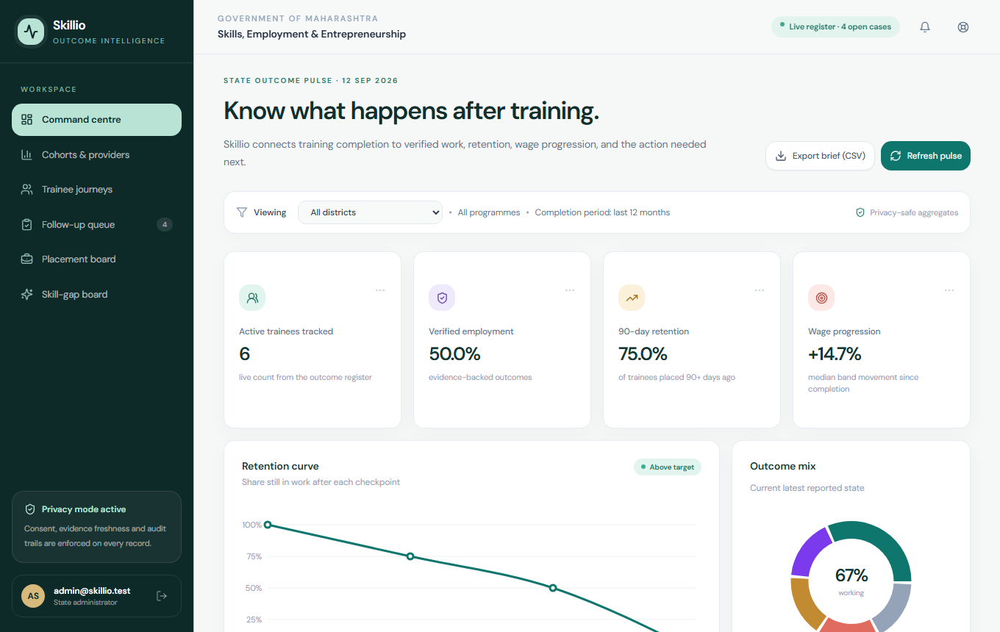
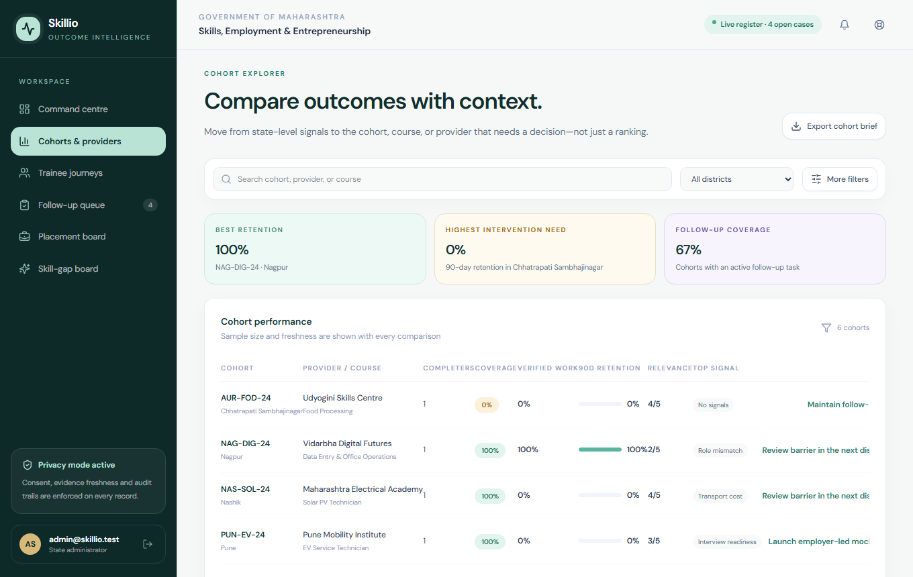
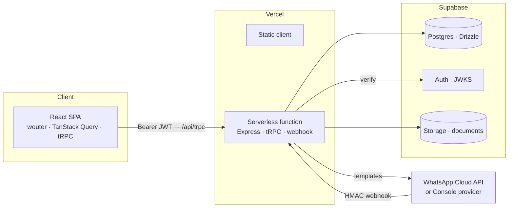

<div align="center">

# Skillio

**Outcome intelligence for government skilling programs.**

Training enrolment is easy to measure. What happens *after* training is not.
Skillio closes that gap — verified employment, 90-day retention, and wage
progression, with the follow-up, privacy, and accountability machinery to keep
the register honest.

[![Live demo]][Live demo URL]
[![Tests 113 passing]][PROJECT GUIDE.md#18-testing-strategy]
[![TypeScript strict]][PROJECT GUIDE.md]
[![MIT License]][LICENSE]

</div>

---

| | |
|---|---|
| **Live app** | https://skillio-delta.vercel.app |
| **Demo staff login** | `admin@skillio.test` · password in [ROADMAP.md](ROADMAP.md) *(demo-only credential)* |
| **Full technical guide** | [PROJECT_GUIDE.md](PROJECT_GUIDE.md) — every component, API, and feature explained |
| **Stack** | React 19 · Vite 7 · Tailwind 4 · tRPC 11 · Express 4 · Drizzle ORM · Supabase (Postgres + Auth + Storage) · Vercel |

## What it does

<div align="center">
  
  <p><sub>Command Centre — the state outcome pulse, rendered live from Postgres.</sub></p>
</div>

A district counsellor logs in and sees the truth, not a spreadsheet:

- **Command Centre** — verified employment share, 90-day retention, wage progression (computed from an append-only outcome chain), outcome mix, per-district pulse, CSV brief export.
- **Trainee journeys** — a full timeline that *never overwrites history*: every outcome pulse, employer confirmation, and support case, plus an evidence-confidence card and a rule-based next-best-action.
- **Follow-up queue** — priority P1–P4 cases, automated checkpoint reminders, a 60-second scheduler, and one-click WhatsApp/SMS outreach that is idempotent by design.
- **Employer verification** — single-use signed links; an employer's confirmation upgrades evidence from self-reported to verified and can auto-open the employee portal.
- **Employee portal (`/me`)** — passwordless capability-token career page: wage history, certificates, document vault (Supabase Storage, consent-gated, 24-month retention), benefits eligibility, grievances.
- **Verified Career Passport** — a public, QR-shareable, hash-integrity-checked profile built *only* from register-verified claims, with opt-in wage/employer disclosure and revocable share links.
- **Job exchange** — deterministic, fully explainable match scoring; confirmed placements flow straight back into the outcome chain.
- **Skill-gap board & provider scorecards** — barriers aggregated into severity-ranked interventions; public provider accountability with small-sample suppression (n < 10).

<div align="center">
  
  <p><sub>Cohorts & providers — coverage, retention, and the top barrier per cohort.</sub></p>
</div>

## Architecture



One Express app, three runtimes: dev (`tsx watch` + Vite middleware), local prod
(`node dist/index.js` + static), and Vercel (self-contained ESM bundle behind a
thin function entry). Every request flows through typed tRPC procedures with
role + district scoping — there is no raw REST surface.

## Principles baked into the code

1. **Append-only truth** — outcome events and audit trails supersede, never mutate or delete.
2. **Links are capabilities** — single-use JWTs for employer verification, revocable rows for pulse links, opt-in scopes for passport data. Bad, forged, and expired tokens are indistinguishable (anti-enumeration).
3. **Privacy by default** — consent is purpose-scoped with hashed receipts; inbound message content is never stored; provider stats suppress small samples; `contactPhone` never renders; RLS is deny-by-default at the database.
4. **Explainable numbers** — match scores, risk flags, evidence confidence, and benefit eligibility all ship their underlying facts to the UI. No black-box dashboards.
5. **LLM-free determinism** — every metric, score, and decision in this repo is deterministic SQL + rules.

## Quick start

```bash
# prerequisites: Node 22+ (Supabase client needs global WebSocket), corepack (pnpm 10.4.1), a Supabase project
git clone https://github.com/SujayYadav776/Skillio.git
cd Skillio

cp .env.example .env        # fill DATABASE_URL, SUPABASE_*, JWT_SECRET
corepack enable

pnpm install
pnpm db:push                # apply migrations (drizzle/migrations)
pnpm db:seed                # deterministic demo personas
pnpm db:rls                 # optional: deny-by-default RLS

pnpm dev                    # http://localhost:3000
```

| Script | Purpose |
|---|---|
| `pnpm dev` | Express + Vite dev server (HMR, auto port from 3000) |
| `pnpm build` | Vite client → `dist/public`, Node server → `dist/index.js`, serverless bundle → `dist/serverless.mjs` |
| `pnpm start` | Run the built production server locally |
| `pnpm check` | Strict TypeScript, no emit |
| `pnpm test` | Vitest — unit + integration against the dev DB (sequential by design) |
| `pnpm db:push · db:seed · db:rls` | Migrations · demo data · row-level security |

## Project layout

```
client/          React SPA — 14 screens, lazy routes, 6 UI primitives, hand-rolled design system
server/          Express + tRPC (routers.ts), domain layer (queries/benefits/exchange/
                 passport/grievances), messaging adapter, scheduler, Supabase auth & storage
shared/          Types shared end-to-end (the tRPC router is the API contract)
drizzle/         Schema + migrations 0000–0007
api/             Vercel function (thin re-export of the self-contained bundle)
PROJECT_GUIDE.md Deep dive: data model, every API procedure, every feature's mechanics
ROADMAP.md       Build phases and decisions   ·   RECOMMENDATION.md — future themes
```

## Deployment

Pushes to `main` auto-deploy on Vercel (static SPA + one Node 24 serverless
function; env vars live in Vercel's encrypted store). The scheduler is disabled
in the serverless runtime — see [PROJECT_GUIDE.md §16](PROJECT_GUIDE.md#16-vercel-deployment-and-the-esm-bug-it-required-fixing)
for the ESM bundling story behind `api/index.ts`.

## Status

Phases 0–6 complete: live database, full tRPC API, all screens wired, real
verification/pulse/portal/passport/exchange/benefit/grievance flows, district
scoping, 113/113 tests passing, deployed with CI/CD. Current backlog and
honest gaps (unwired PII cipher, cron-based scheduler for serverless, magic-link
auth) are listed in [PROJECT_GUIDE.md §21](PROJECT_GUIDE.md#21-known-gaps--future-work).

## License

MIT — see [LICENSE].

<!-- badge links -->
[Live demo]: https://img.shields.io/badge/live%20demo-▲%20Vercel-000?style=flat-square
[Live demo URL]: https://skillio-delta.vercel.app
[Tests 113 passing]: https://img.shields.io/badge/tests-113%20passing-2ea66f?style=flat-square
[TypeScript strict]: https://img.shields.io/badge/TypeScript-strict-3178c6?style=flat-square
[MIT License]: https://img.shields.io/badge/license-MIT-6d50ad?style=flat-square
[LICENSE]: LICENSE
[PROJECT GUIDE.md]: PROJECT_GUIDE.md
